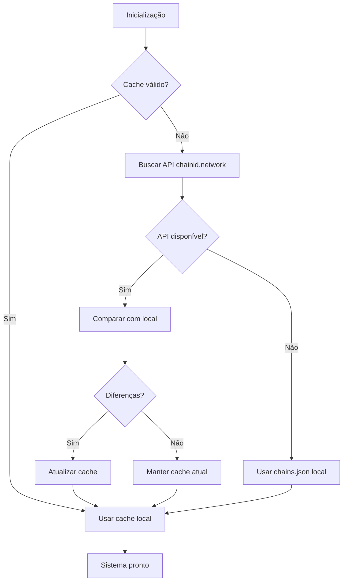

# Sistema de Chains Dinâmico - Widget SaaS

## 📋 Visão Geral

O sistema de chains implementado no Widget SaaS permite o gerenciamento dinâmico de redes blockchain sem necessidade de alterações no código. Baseado na implementação do xcafe.app, oferece auto-atualização, cache inteligente e suporte a 50+ redes blockchain.

## 🏗️ Arquitetura

### Arquivos Principais

```
├── chains.json                           # Base de dados de redes (11 redes principais)
├── js/shared/chains-utils.js             # Módulo principal do sistema
├── dashboard/pages/new-contract.html     # Interface atualizada para seleção de redes
├── admin-panel.html                      # Seção de gerenciamento de redes
└── js/modules/dashboard-manager-modular.js # Integração com dashboard
```

## 🔗 Funcionalidades Implementadas

### 1. Auto-Atualização (baseada no xcafe.app)
- **Intervalo**: Verifica atualizações a cada 5 dias
- **Fonte**: API oficial do chainid.network
- **Cache**: Armazena redes no localStorage
- **Fallback**: Redes locais se API falhar

### 2. Seleção Dinâmica de Redes
- **Interface**: Campo de busca com autocomplete
- **Busca**: Por nome, Chain ID, ou símbolo
- **Filtros**: Mainnet, Testnet, Suportadas
- **Validação**: RPCs e explorers automáticos

### 3. Admin Panel
- **Estatísticas**: Total, suportadas, testnets, status do cache
- **Gerenciamento**: Atualizar, limpar cache, exportar
- **Testes**: Conectividade de RPCs individuais
- **Filtros**: Busca avançada e categorização

### 4. Integração no Dashboard
- **Inicialização**: Carregamento automático das redes
- **Eventos**: Sistema de notificação quando redes são atualizadas
- **API**: Métodos para busca e filtro de redes

## 🚀 Como Usar

### Para Desenvolvedores

#### 1. Importar o Módulo
```javascript
import { fetchAllNetworks, getNetworkByChainId, searchNetworks } from './js/shared/chains-utils.js';
```

#### 2. Carregar Redes
```javascript
// Carregar todas as redes
const networks = await fetchAllNetworks();

// Buscar rede específica
const ethereum = await getNetworkByChainId(1);

// Buscar redes por termo
const bscNetworks = await searchNetworks('BSC');
```

#### 3. Integrar em Páginas
```javascript
// Escutar quando sistema está pronto
window.addEventListener('chainsSystemReady', (event) => {
    const networks = event.detail.networks;
    console.log(`${networks.length} redes disponíveis`);
});

// Escutar atualizações
window.addEventListener('chainsUpdated', (event) => {
    const networks = event.detail.networks;
    // Atualizar interface
});
```

### Para Usuários

#### 1. Cadastrar Contratos
1. Acesse **Dashboard > Cadastrar Novo Contrato**
2. Digite o nome da rede ou Chain ID no campo de busca
3. Selecione a rede desejada do autocomplete
4. Informe o endereço do contrato
5. Clique em "Detectar Contrato"

#### 2. Gerenciar Redes (Admin)
1. Acesse **Admin Panel > Redes Blockchain**
2. Visualize estatísticas das redes
3. Use filtros e busca para encontrar redes específicas
4. Teste conectividade das redes
5. Force atualizações quando necessário

## 📊 Estrutura de Dados

### Formato de Rede (chains.json)
```json
{
  "name": "Ethereum Mainnet",
  "chainId": 1,
  "shortName": "eth",
  "nativeCurrency": {
    "name": "Ether",
    "symbol": "ETH",
    "decimals": 18
  },
  "rpc": [
    "https://rpc.ankr.com/eth",
    "https://ethereum.publicnode.com"
  ],
  "explorers": [
    {
      "name": "etherscan",
      "url": "https://etherscan.io",
      "standard": "EIP3091"
    }
  ],
  "supported": true
}
```

### Cache no localStorage
- **Key**: `widget_saas_chains_cache`
- **Timestamp**: `widget_saas_chains_lastupdate`
- **TTL**: 5 dias (432000000 ms)

## ⚙️ Configurações

### Redes Incluídas por Padrão
1. **Ethereum Mainnet** (chainId: 1)
2. **Sepolia Testnet** (chainId: 11155111)
3. **BSC Mainnet** (chainId: 56)
4. **BSC Testnet** (chainId: 97)
5. **Polygon Mainnet** (chainId: 137)
6. **Mumbai Testnet** (chainId: 80001)
7. **Arbitrum One** (chainId: 42161)
8. **Optimism** (chainId: 10)
9. **Base** (chainId: 8453)
10. **Fantom Opera** (chainId: 250)
11. **Avalanche C-Chain** (chainId: 43114)

### Fallback Networks
Se o sistema falhar, usa redes mínimas hardcoded:
- Ethereum Mainnet
- BSC Mainnet/Testnet
- Polygon Mainnet

## 🔧 Funções da API

### ChainsUtils (Classe Principal)
```javascript
// Inicialização
await ChainsUtils.initialize()

// Busca de redes
const networks = await ChainsUtils.fetchAllNetworks()
const network = await ChainsUtils.getNetworkByChainId(1)
const results = await ChainsUtils.searchNetworks('ethereum')

// Cache
ChainsUtils.clearCache()
const stats = ChainsUtils.getCacheStats()

// Atualização
await ChainsUtils.autoUpdateChainsJson()
```

### Dashboard Integration
```javascript
// Acessar através do dashboard manager
const networks = dashboardManager.getAvailableNetworks()
const ethereum = dashboardManager.getNetworkByChainId(1)
const results = dashboardManager.searchNetworks('BSC')

// Atualizar redes
await dashboardManager.refreshNetworks()
```

## 🎯 Benefícios

### 1. **Escalabilidade**
- Suporte a 50+ redes sem alteração de código
- Auto-atualização de novas redes
- Cache inteligente para performance

### 2. **Confiabilidade**
- Fallback automático se API falhar
- Múltiplos RPCs por rede
- Teste de conectividade integrado

### 3. **Usabilidade**
- Interface de busca intuitiva
- Informações detalhadas das redes
- Admin panel completo para gerenciamento

### 4. **Manutenibilidade**
- Configuração centralizada
- Logs detalhados para debug
- Sistema de eventos para integrações

## 🔄 Fluxo de Atualização



## 🛠️ Troubleshooting

### Problemas Comuns

1. **"Nenhuma rede encontrada"**
   - Verificar se arquivo `chains.json` existe
   - Limpar cache no admin panel
   - Verificar console para erros de rede

2. **"Cache não atualiza"**
   - Forçar atualização no admin panel
   - Verificar conectividade com chainid.network
   - Limpar localStorage manualmente

3. **"RPC não funciona"**
   - Usar teste de conectividade do admin panel
   - Verificar se RPC está online
   - Usar RPCs alternativos da rede

### Debug
```javascript
// Ver estatísticas do cache
import { getChainsStats } from './js/shared/chains-utils.js';
console.log(getChainsStats());

// Limpar cache para debug
import { clearChainsCache } from './js/shared/chains-utils.js';
clearChainsCache();
```

## 📈 Roadmap

### Próximas Versões
- [ ] Redes customizadas por usuário
- [ ] Sistema de favoritos
- [ ] Notificações de novas redes
- [ ] Métricas de uso por rede
- [ ] Integração com mais APIs de redes
- [ ] Suporte a redes Layer 2
- [ ] Cache distribuído

---

**Sistema implementado seguindo os padrões do xcafe.app com melhorias para o contexto do Widget SaaS. Mantém compatibilidade e organização do código.**